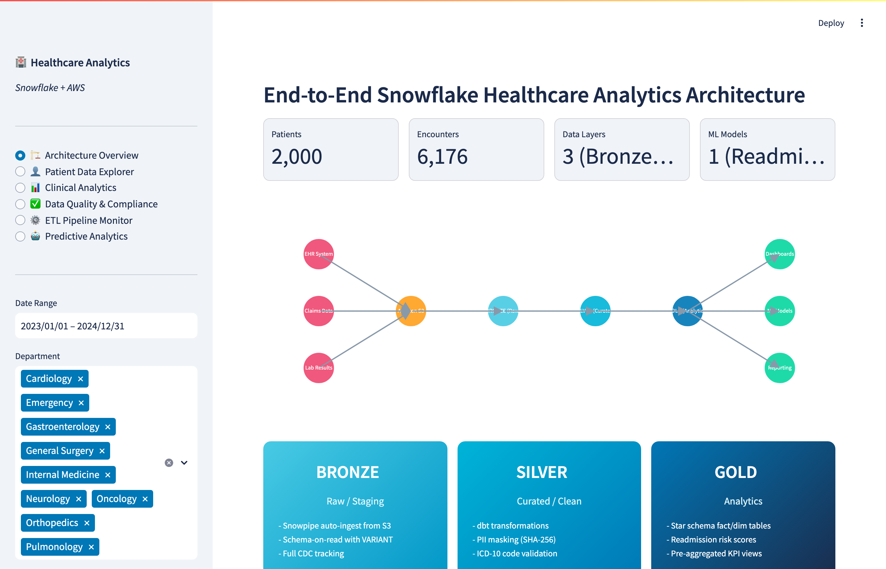

# Healthcare Analytics Platform Demo

An interactive Streamlit application demonstrating a **Snowflake-based healthcare analytics platform** — with HIPAA-compliant data handling, clinical analytics, dbt transformation monitoring, and ML-powered readmission prediction.

**[View Live Demo](https://anualli-demo-healthcare-analytics.streamlit.app)**

---

## What This Project Demonstrates

This demo simulates a production healthcare analytics environment, showcasing:

- **Medallion Architecture** (Bronze → Silver → Gold) designed for healthcare data on Snowflake
- **Patient Data Explorer** with demographic analysis, admission volume trends, and filterable patient records
- **Clinical Analytics** including readmission rates, top diagnoses, length-of-stay analysis, cost by department, and mortality trends
- **HIPAA Compliance & Data Quality** with live PII masking demonstrations, data completeness checks, referential integrity validation, and audit trail logging
- **ETL Pipeline Monitor** with dbt transformation DAG visualization, execution heatmaps, and pipeline health metrics
- **Predictive Analytics** using scikit-learn LogisticRegression for 30-day readmission prediction with AUC curves, feature importance, confusion matrices, and risk stratification gauges

The app generates realistic synthetic patient data with proper medical coding (ICD-10 diagnoses, department assignments, insurance types).

---

## Screenshots

### Architecture Overview
Node diagram with Bronze/Silver/Gold medallion layers for healthcare data processing on Snowflake.


### Patient Data Explorer
Demographic breakdowns, admission volume trends, and searchable patient records.


### Clinical Analytics
Readmission rates, top diagnoses, length-of-stay distributions, cost analysis, and mortality trends.



### Data Quality & Compliance
PII masking demo, completeness scores, referential integrity checks, and HIPAA audit trail.


### ETL Pipeline Monitor
dbt transformation DAG, execution heatmap, and pipeline health metrics.


### Predictive Analytics
ML readmission model with AUC/ROC curve, feature importance, risk distribution, and confusion matrix.


---

## Tech Stack

- **Warehouse:** Snowflake (medallion architecture)
- **Transformations:** dbt (data build tool)
- **ML:** scikit-learn (LogisticRegression, StandardScaler)
- **Compliance:** HIPAA PII masking, audit logging
- **Visualization:** Streamlit, Plotly
- **Languages:** Python, SQL

## Run Locally

```bash
pip install -r requirements.txt
streamlit run app.py
```

## License

MIT
